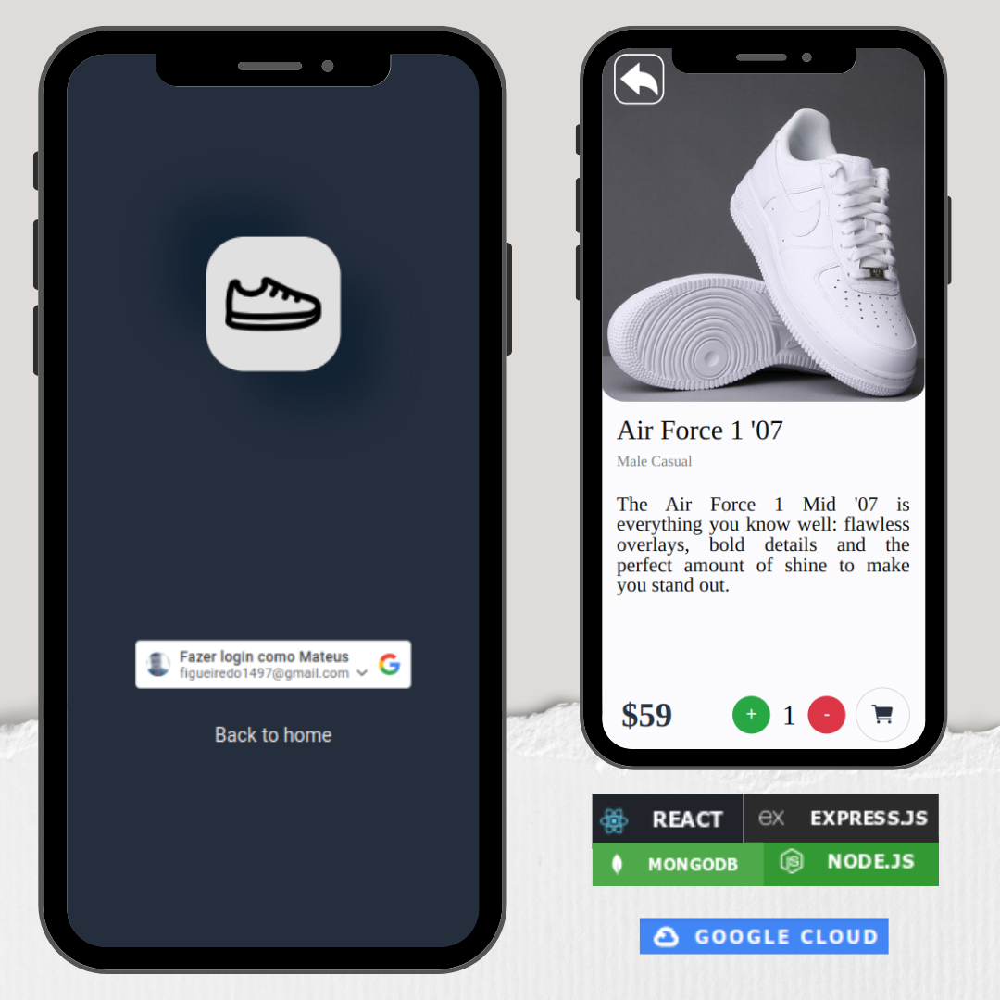
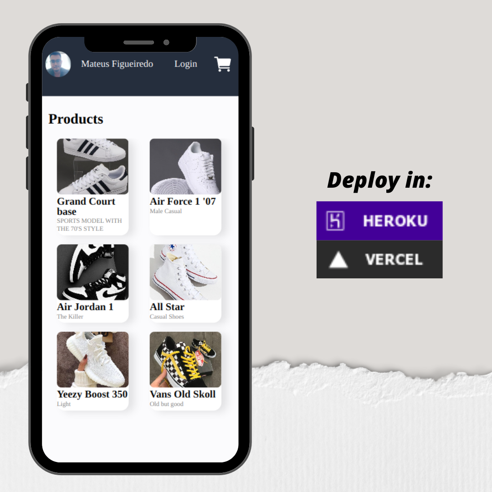

<!-- PROJECT LOGO -->
 

  

<h3 align="center">Sneakers Store | Front end</h3>
     
    <a href="https://sneakers-store-front.vercel.app/"><strong>Deploy in Vercel»</strong></a>

  <h3 align="center">Built With</h3>
  
  
    
    

  

  

 
The project proposal was to implement a backend for an e-commerce with 4 main elements: Login, Products, Cart, Check-out.

A proposta do projeto foi implementar um backend para um e commerce com 4 principais elementos: Login, Produtos, Carrinho, Finalizar compra.
<!-- CONTACT -->
### Contact

[![LinkedIn][linkedin-shield]][linkedin-url]

<!-- MARKDOWN LINKS & IMAGES -->

[linkedin-shield]: https://img.shields.io/badge/-LinkedIn-black.svg?style=for-the-badge&logo=linkedin&colorB=blue
[linkedin-url]: https://www.linkedin.com/in/mateus-figueiredo-pereira/